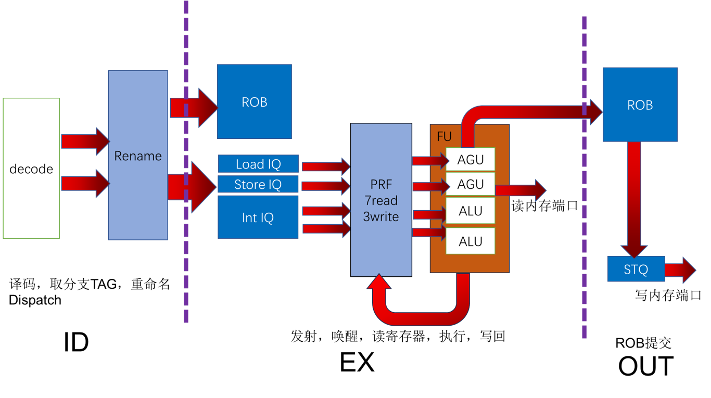
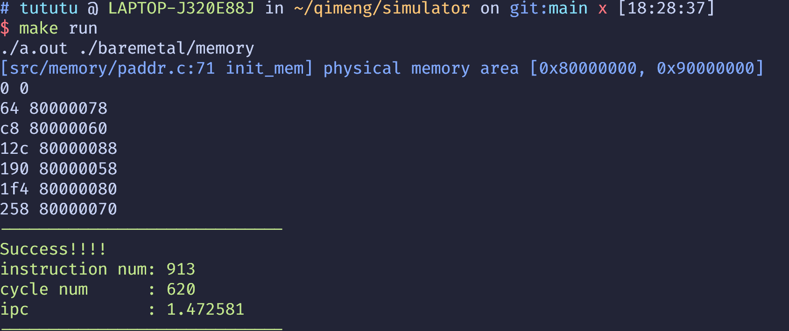

## 双发射模拟器

在启蒙1号单周期处理器基础上修改

back-end/中分出了各个模块，每个模块有时序逻辑（seq）和组合逻辑（comb_xxx)

diff/和/nemu/是difftest部分，用于比对每条指令提交的结果是否正确

模块有外部输入输出in、out以及和自身存储单元（DFF、SRAM）间的输入输出

组合逻辑根据部分输入生成部分输出，时序逻辑更新存储单元

TOP为顶层，组合逻辑因为各模块间的依赖关系需要划分为不同部分并且按照一定顺序执行（很麻烦，不知道怎么优化）

## 用法

交叉编译工具为师兄提供的环境，需要修改baremetal/common.mk
中的`RISCV_PATH`为正确的目录或自己编译安装toolchains

例：`make ALL=min3 run` 将编译test/下的min3.c作为测试程序，
将编译后提取出的二进制文件memory放入模拟器的内存，然后运行

`make run` 将会批量执行所有test/下的测试程序

模拟器通过判断是否写入0x1c来判断程序是否结束，并将写入0x1c的值作为返回值，
正常情况下返回0表示运行正确，如图所示

`./back-end/include/config.h`中的`LOG`可以控制是否打印信息（取值，rob提交），
`MAX_SIM_TIME`控制最多的周期，超过这个周期认为超时

string和hello-str需要klib支持，其余程序目前已经可以通过测试

