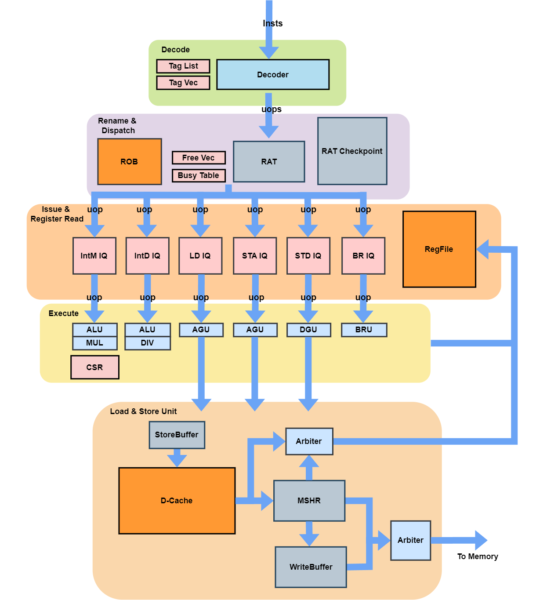
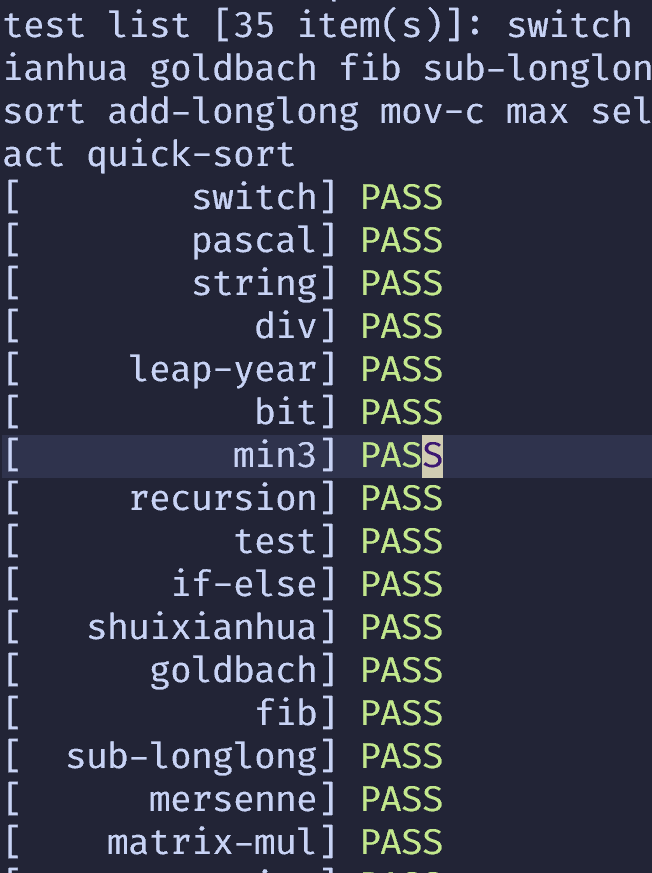
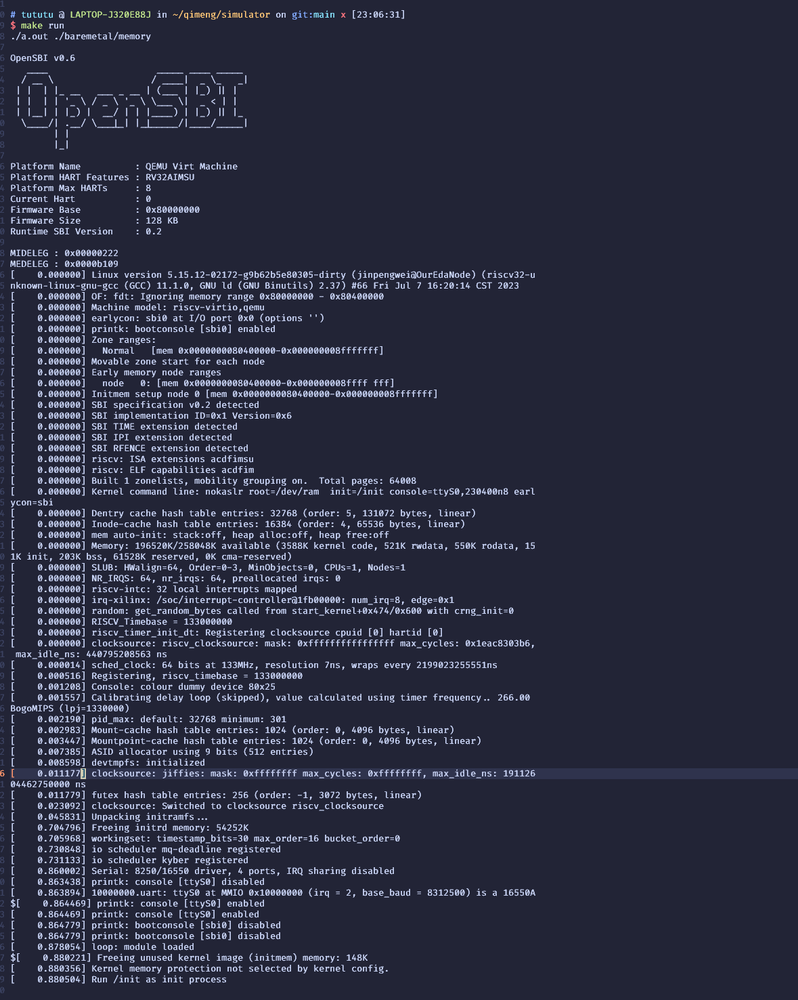

# RISC-V 乱序执行模拟器

## 1. 项目简介
本模拟器是一个高性能、周期精确（Cycle-Accurate）、IO 精确（IO-Accurate）的 RISC-V 处理器仿真平台，实现了约 10 级深度的乱序执行（Out-of-Order Execution）微架构。

本项目适用于体系结构探索与性能分析评估，支持从 Baremetal 裸机程序测试到启动完整 Linux 操作系统。



### 核心特性
- **流水线设计**：采用约 10 级深度的乱序流水线架构（包含前端取指、预测、预解码，及后端 Decode -> Rename -> Dispatch -> Issue/RegRead -> Execute -> WriteBack -> Commit）。
- **标准支持**：支持 RISC-V RV32IMABSU 指令集，具备运行 Linux 的能力。
- **微架构组件**：包含取指目标队列（FTQ, Fetch Target Queue）、重排序缓冲区（ROB, Reorder Buffer）和动态分支预测等关键模块。
- **性能分析**：内置自顶向下微架构分析方法（TMA），可量化 Frontend Bound、Backend Bound、Bad Speculation 和 Retiring 指标。

---

## 2. 快速开始
快速构建与测试：

```bash
make
./build/simulator ./baremetal/memory
```

常用模式示例：

```bash
# 正常运行模式（默认）
./build/simulator path/to/binary.bin

# 快照恢复模式（支持 -w 设置 warmup 周期数，-c 设置仿真最大指令数）
./build/simulator --mode ckpt -w 10000000 -c 15000000000 path/to/checkpoint.gz

# 混合快进模式（需指定 -f）
./build/simulator --mode fast -f 1000000 path/to/binary.bin

# 仅参考模型模式
./build/simulator --mode ref path/to/binary.bin
```

---

## 3. 仿真运行模式
模拟器支持四种核心运行模式，可通过 `-m` 或 `--mode` 参数切换，同时支持多个附加参数（如 `-w`, `-c`, `-f`）：

- **正常运行 (RUN)**: 从 0x80000000 开始执行完整的乱序流水线模拟（默认模式）。
  - 示例：`./build/simulator path/to/binary.bin`
- **快照恢复 (CKPT)**: 从指定的 .gz 快照文件恢复系统状态并继续执行。可通过 `-w` 设定 O3 warmup 周期数，`-c` 设定最大提交指令数。
  - 示例：`./build/simulator --mode ckpt -w 10000000 -c 100000000 path/to/checkpoint.gz`
- **混合快进 (FAST)**: 先使用简单的参考模型快速跳过启动阶段，再切换到乱序模拟器执行。
  - 示例：`./build/simulator --mode fast -f 1000000 path/to/binary.bin`
- **参考模型 (REF)**: 仅运行轻量级参考模型 (Ref Model)，用于功能校验。
  - 示例：`./build/simulator --mode ref path/to/binary.bin`

---

## 4. 测试程序与基准测试
测试程序位于 `baremetal/` 目录下，主要分为：

- **小程序测试集**：位于 `baremetal/test/cpu-tests`，包含近 40 个基础功能测试用例。
  - 运行方式：在 `baremetal/test` 目录下执行 `make run`。
- **性能基准测试**：包含 **Coremark** (`baremetal/coremark`) 与 **Dhrystone** (`baremetal/dhrystone`)。



---

## 5. 操作系统支持 (OS Booting)
模拟器具备运行全功能操作系统的能力，实现了对 MMU、特权级切换及中断/异常处理的完整模拟。



---

## 6. 开发与配置说明
- **代码结构**：
  - `back-end/`: 包含各模块的时序逻辑 (`seq`) 和组合逻辑 (`comb`)。
  - `back-end/include/IO.h`: 定义模块间接口。
  - `diff/`: 用于与参考模型进行时钟级对标。
- **配置参数**：
  - 修改 `include/config.h` 中的日志开关（如 `LOG_ENABLE`）可控制调试信息输出。
  - `MAX_SIM_TIME` 用于配置仿真超时的周期上限。
- **详细设计文档**：
  - 请参阅 `doc/modules/` 目录下的各模块设计文档（如 `FTQ_Design.md`, `TMA_Analysis.md`）。
