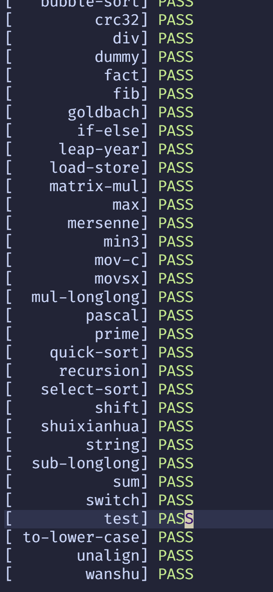

## 乱序执行模拟器

back-end/中分出了各个模块，每个模块有时序逻辑（seq）和组合逻辑（comb)

diff/是difftest部分，使用启蒙1号模拟器作为参考，比对每条指令提交后的寄存器以及对内存的操作是否正确

分为六级流水线   Decode->Rename/Dispatch->Issue/Register Read->Execute->Write Back->Commit

## 用法

`./a.out memory`

参数为需要执行的程序

交叉编译工具为师兄提供的环境，需要修改baremetal/common.mk
中的`RISCV_PATH`为正确的目录或自己编译安装toolchains，主要是Uart相关

模拟器通过ebreak指令来判断程序是否结束

baremental/中的test移植了一生一芯项目的测试小程序，例：`make ALL=min3 run` 将编译baremental/test/下的min3.c作为测试程序，将编译后提取出的二进制文件memory放入模拟器的内存，然后运行

在baremental/test目录下执行`make run`会一键执行所有小测试程序 

目前支持RV32IMA，大概能够成功启动Linux

`./back-end/include/config.h`中的`LOG`可以控制是否打印信息（取指令，rob提交），
`MAX_SIM_TIME`控制最多的周期，超过这个周期认为超时

