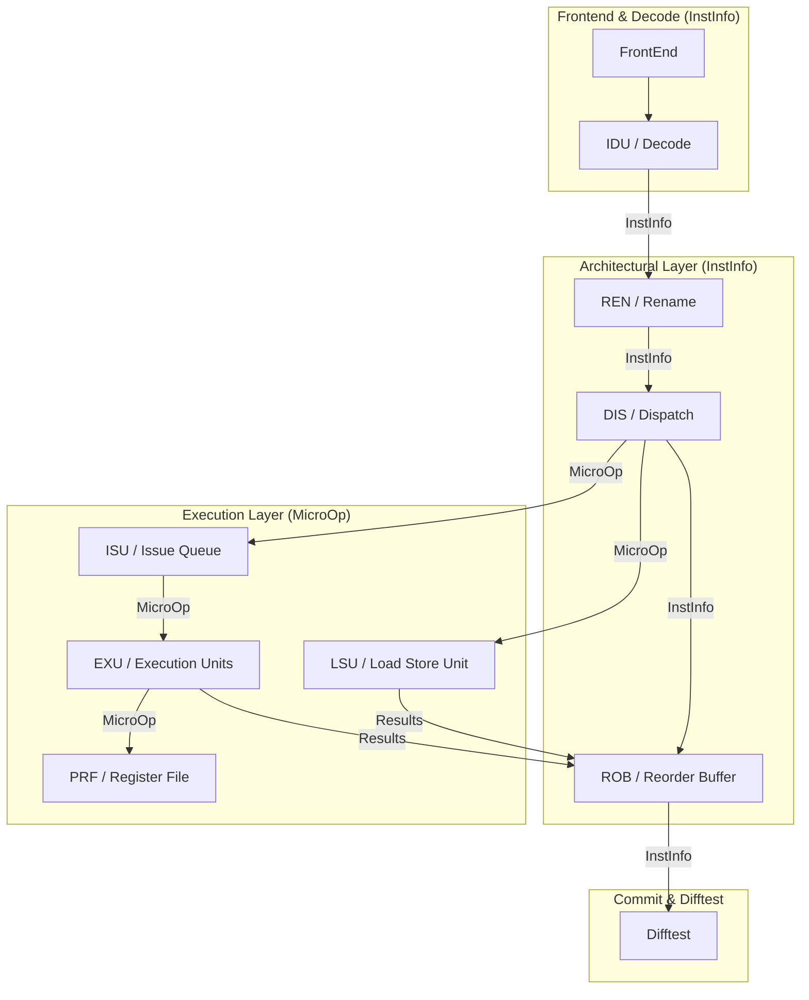

# 模拟器架构解耦：架构状态与微架构执行分离

## 核心目标
将模拟器后端的指令数据流拆分为两层，以解耦架构状态（ISA）与微架构执行（Pipeline）：

1. **InstInfo (架构层)**：仅包含 ISA 定义的信息（PC、指令码、逻辑寄存器索引、立即数）。用于前端译码、ROB 提交、以及 Difftest 验证。
2. **MicroOp (执行层)**：仅包含流水线执行所需的信息（物理寄存器索引、功能单元 opcode、TAG、Busy 位）。用于 Rename 之后的发射与执行。

## 数据流架构图

## 实施路线图

1. **结构体定义**：在 `types.h` 中拆分 `InstUop` 为 `InstInfo` 和 `MicroOp`。
2. **接口更新**：在 `IO.h` 中更新模块间通信协议。
3. **模块适配**：
    - `Idu` & `Ren` 使用 `InstInfo`。
    - `Dispatch` 作为转换层，将 `InstInfo` 转换为 `MicroOp` 并分发。
    - `Isu`, `Exu`, `Lsu` 使用 `MicroOp`。
    - `Rob` 存储 `InstInfo` 以便按序提交。
4. **清理冗余**：验证功能正确后，逐步删除各层中的非必要字段。
