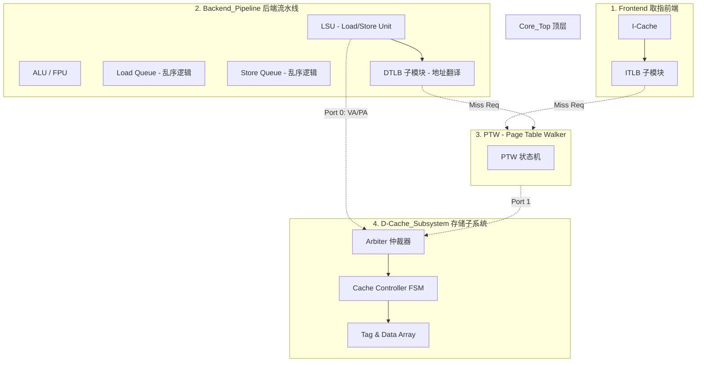

# 解耦 MMU 与存储子系统重构方案

## 1. 核心目标
- **深度解耦**：将地址翻译 (TLB) 与存储访问 (Cache) 逻辑从流水线中解耦。
- **模块化层级**：建立清晰的 Frontend, Backend, PTW, 和 DCache Subsystem 层级。
- **共享与仲裁**：通过统一的仲裁器 (Arbiter) 管理 PTW 和 LSU 对数据缓存的并发访问。

## 2. 目标架构层级 (Core_Top)

根据设计需求，建议的模块化结构如下：

## 3. 详细职责定义

### 3.1 LSU (Load/Store Unit)
- **职责**：处理访存指令的生命周期，包括 AGU 计算、LQ/SQ 冲突检测、Store-to-Load Forwarding。
- **地址翻译**：持有一个私有的 **DTLB**。在翻译成功后，向 `D-Cache_Subsystem` 发起物理地址请求。
- **解耦点**：LSU **不持有** Cache 本体，仅通过一套标准的逻辑总线接口（Req/Resp）与存储子系统通信。

### 3.2 PTW (Page Table Walker)
- **职责**：作为全系统的翻译服务，接收 ITLB 和 DTLB 的缺失请求。
- **存储访问**：当需要读取页表项 (PTE) 时，作为 `D-Cache_Subsystem` 的另一个客户端，向其发起读取请求。

### 3.3 D-Cache_Subsystem (关键模块)
- **仲裁器 (Arbiter)**：
    - **Port 0**：服务于 LSU（高带宽需求）。
    - **Port 1**：服务于 PTW（低频但关键）。
- **缓存控制器**：负责处理命中、缺失以及与下级总线 (L2/Memory) 的交互。

## 4. 接口一致性与透明度

- **统一请求接口**：无论访问者是 LSU 还是 PTW，对于 `D-Cache_Subsystem` 而言都是一个物理地址读写请求。
- **理想模式支持**：
    - 仲裁器可以配置为“极速模式”，此时直接分发给 `SimpleMmu` 的理想逻辑，绕过真正的缓存延迟。
    - 这保证了在不同仿真精度下，核心流水线代码无需任何修改。

## 5. 实施路线图

1.  **清理现场**：移除之前试探性添加的 `TlbMmu` 适配器代码，恢复到干净的 legacy 状态。
2.  **模块隔离**：
    - 将 `SimpleCache` 从 `SimpleLsu` 中提取出来，封装为 `DCacheSubsystem`。
    - 为 `DCacheSubsystem` 添加简单的仲裁逻辑。
3.  **TLB 嵌入**：
    - 将 `TLB` 类分别实例化到 `ICache` 和 `LSU` 内部。
4.  **PTW 独立化**：
    - 将 `PTW` 逻辑移至 `SimCpu` 顶层统一管理。
5.  **对接与验证**：重新连接信号流，验证 Sv32 模式下的指令取指和数据访问。
