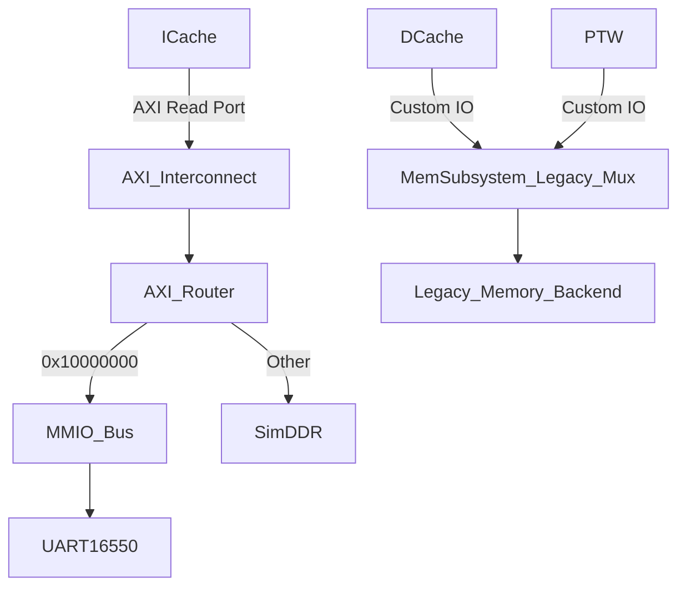

# AXI Interconnect Integration

## 简介
目前模拟器在内存子系统 (`MemSubsystem`) 中引入了 `axi-interconnect-kit`，旨在提供一个标准化的 AXI 互连后端，以取代以往简单理想化的访存方式。这也为后续更精确地模拟总线竞争、延迟和带宽瓶颈打下了基础。

## 现状与影响范围

当前阶段（对应 PR `28d02bf` 等），AXI 互连**仅接入了 ICache（指令缓存）**的读数据通路。

- **ICache**：其 Miss 读请求已通过 `axi_interconnect::MASTER_ICACHE` 端口发送至新的 AXI 互连网络。
- **DCache / PTW**：目前**不受影响**。DCache（基于 `SimpleCache` 实现）的访存请求和 PTW（Page Table Walker）仍然通过原有的简单请求/响应路由逻辑（`dcache_req_mux` 和 `resp_route_block`）直接与后端交互，并没有挂载到 AXI 总线上。

## 架构拓扑


## 配置指南

系统提供了相关的宏定义，位于 `include/config.h` 文件中，用于控制 AXI 行为：

1. **开关 ICache 的 AXI 端口**
   ```cpp
   // 开启 (默认)
   #define CONFIG_ICACHE_USE_AXI_MEM_PORT 1
   // 关闭
   #define CONFIG_ICACHE_USE_AXI_MEM_PORT 0
   ```

2. **选择 AXI 协议标准**
   ```cpp
   // 支持 AXI4 (4，默认推荐) 或 AXI3 (3，为了向后兼容)
   #define CONFIG_AXI_PROTOCOL 4
   ```

## 初始化顺序注意事项
为了防止前端发起请求时后端还未初始化的问题，仿真器的初始化顺序已被修改为：
1. `mem_subsystem.init()`：先初始化 AXI Interconnect、Router、DDR 和 MMIO 设备。
2. `front.init()`：然后再初始化前端和分支预测等模块。
