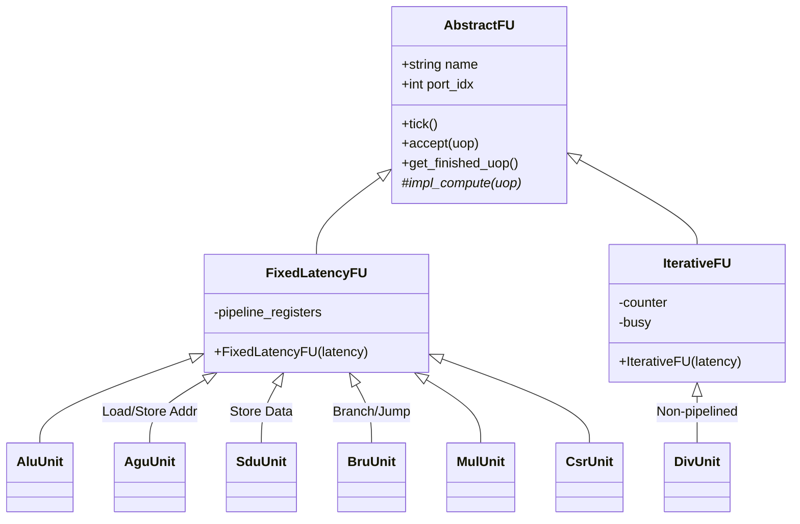

# Exu (Execution Unit) 设计文档

## 1. 概述 (Overview)
Exu (Execution Unit) 是后端流水线的计算中心，负责执行所有的微操作 (Uops)。它管理着多种异构的功能单元 (Functional Units, FUs)，并负责将执行结果广播给旁路网络 (Bypass Network) 和写回总线。

## 2. 接口定义 (Interface Definition)

### 2.1 核心输入接口

| 信号/字段 | 位宽 (bits) | 方向 | 来源/去向 | 描述 |
| :--- | :--- | :--- | :--- | :--- |
| `prf2exe.iss_entry` | `ISSUE_WIDTH * sizeof(Entry)` | 输入 | Prf | 已读取操作数的待执行指令 |
| `dec_bcast.mispred` | 1 | 输入 | Idu | 分支误预测信号 (用于 Kill 正在执行的指令) |
| `rob_bcast.flush` | 1 | 输入 | ROB | 全局冲刷信号 |

### 2.2 核心输出接口

| 信号/字段 | 位宽 (bits) | 方向 | 来源/去向 | 描述 |
| :--- | :--- | :--- | :--- | :--- |
| `exe2iss.ready` | `ISSUE_WIDTH * 1` | 输出 | Isu | 各发射端口对应的 FU 是否空闲 (Credit/Busy) |
| `exe2prf.bypass` | `TOTAL_FU * sizeof(Entry)` | 输出 | Prf | **旁路广播**：所有 FU 完成的结果 (含推测结果) |
| `exe2prf.entry` | `ISSUE_WIDTH * sizeof(Entry)` | 输出 | Prf | **写回总线**：经过滤和仲裁后的 PRF 写回结果 |
| `exu2rob.entry` | `ISSUE_WIDTH * sizeof(Entry)` | 输出 | ROB | **早期完成总线**：指令执行完成信号 (脱离 PRF 写回) |
| `exu2id.mispred` | - | 输出 | Idu | **早期跳转恢复**：检测到分支误预测时立即触发前端重定向 |
| `exe2lsu.agu/sdu_req`| - | 输出 | Lsu | 发送给 LSU 的地址或数据请求 |
| `exe2csr` | - | 输出 | Csr | CSR 读写请求 |

---

## 3. 微架构设计 (Microarchitecture)

### 3.1 端口映射与路由 (Port Mapping & Routing)
Exu 并不假设 FU 与发射端口的一一对应关系，而是通过 `port_mappings` 表实现灵活路由：
- 每个发射端口 (`ISSUE_WIDTH`) 对应一组 FUs。
- 组合逻辑根据指令的 `op` 类型（如 `OP_MASK_ALU`, `OP_MASK_LD`）查找该端口下支持此操作的 FU。
- 这种设计允许非对称的 FU 布局（例如，只有 Port 0 支持 MDU，而 Port 0-3 都支持 ALU）。

### 3.2 功能单元 (Functional Units)
系统包含多种类型的 FU，均继承自 `AbstractFU` 基类：
- **ALU (Arithmetic Logic Unit)**: 负责整数算术与逻辑运算 (ADD, SUB, AND, OR, XOR, SHIFT, SLT)。
  - *注*: 对于 `JAL/JALR` 指令，Dispatch 阶段会将其拆分为 `ADD` (用于计算 RD = PC+4) 和 `JUMP` (用于跳转)。ALU 仅处理其中的 `ADD` 微操作，控制流跳转 (`JUMP` 微操作) 由 BRU 处理。
- **BRU (Branch Resolution Unit)**: 负责分支条件计算，并与 FTQ (Fetch Target Queue) 交互以验证预测是否正确。
- **AGU (Address Generation Unit)**: 计算 Load/Store 的虚拟地址，并驱动 LSU 接口。
- **SDU (Store Data Unit)**: 处理 Store 操作的数据部分 (STD)。
- **MDU (Mul/Div Unit)**: 处理乘除法。仿真模型中为简化唤醒逻辑，DIV 采用固定延迟 (`FixedLatencyFU`) 而非动态延迟。
- **CSR (Control Status Register Unit)**: 处理 CSR 读写指令 (`CSRRW`, `CSRRS`, `CSRRC` 等)。

### 3.3 功能单元类层级 (FU Class Hierarchy)

所有 FU 均继承自 `AbstractFU`。
- **FixedLatencyFU**: 适用于流水线化的单元（如 ALU, MUL, AGU），支持每个周期接收新指令。
- **IterativeFU**: 适用于非流水线化的多周期单元（如 DIV），在计算期间处于 Busy 状态，无法接收新指令。

### 3.4 核心接口方法 (Core Interface Methods)
`AbstractFU` 定义了所有功能单元必须实现的统一接口：

| 方法 | 阶段 | 描述 |
| :--- | :--- | :--- |
| `can_accept()` | Issue | 准入检查。返回 `true` 表示 FU 有空闲槽位/未忙繁忙，可接收新指令。 |
| `accept(uop)` | Issue | 接收指令。触发内部计算逻辑 (`impl_compute`) 并初始化延迟计时。 |
| `tick()` | Execute | 时钟步进。更新内部流水线状态或倒计时器。 |
| `get_finished_uop()` | Writeback | 获取结果。返回本周期完成的微操作指针，若无则返回 `nullptr`。 |
| `pop_finished()` | Writeback | 确认结果已写回。从 FU 内部队列或 latch 中移除已完成的指令。 |
| `flush(mask)` | Exception | 冲刷流水线。根据分支掩码移除被 Squash 的推测指令。 |

---

## 4. 组合逻辑功能描述 (Combinational Logic)

### 4.1 `comb_ready` (反压控制)
- **功能描述**：生成 `exe2iss.ready` 信号。
- **逻辑**：只有当指令对应的目标 FU (如 ALU) 不繁忙 (`can_accept()`) 且流水线寄存器为空时，才置 Ready。这实现了基于 Credit 的流控。

### 4.2 `comb_exec` (终极解耦写回重构)
为了实现最高效的数据流驱动，`comb_exec` 采用了“全局扫描 + 选择性分发”的三段式设计：

#### **阶段 1：全局扫描与立即驱动 (Global Scan & Immediate Drive)**
- **操作**：遍历所有 `ISSUE_WIDTH` 发射端口进行 FU 仲裁。
- **立即分发**：
    - **ROB 完成**：非访存指令在赢得仲裁后立即驱动 `exu2rob` 通报完成。
    - **LSU 请求**：访存请求（AGU/SDU）立即驱动 `exe2lsu` 发送。
- **按类收集**：将物理端口的结果分类暂存至静态数组（`int_res` 和 `br_res`），剥离非必要的端口依赖。

#### **阶段 2：选择性写回与回调 (Selective Distribution)**
- **常规写回**：仅遍历 `int_res` 数组，将具备 `dest_en` 的计算结果分发至 `exe2prf`。
- **统一回调**：集中处理来自 LSU 的 Load/STA 异步回调，同时驱动 PRF 数据写回与 ROB 完成通报。

#### **阶段 3：静态分支仲裁 (Static Branch Arbitration)**
- **逻辑**：仅遍历固定大小的 `br_res` 数组进行误预测检测。由于脱离了全局总线扫描，仲裁逻辑更加静态且高效。

---

### 4.3 `comb_to_csr` (CSR 预处理)
- **功能描述**：解析 CSR 指令的读写行为，驱动 CSR 单元接口。

### 4.4 `comb_pipeline` (流水线寄存器管理)
- **功能描述**：管理 `inst_r` (Current) 到 `inst_r_1` (Next) 的状态转换。
- **Flush 处理**：
  - **Global Flush**：清空所有状态。
  - **Mispred**：检查 `inst_r` 中的指令是否属于被取消的分支路径 (Tag Match)。若是，则 Kill 该指令（置 Valid 为 0）。

---

## 5. 性能计数器 (Performance Counters)

| 计数器名称 | 指标含义 | TMA 层级 | 描述 |
| :--- | :--- | :--- | :--- |
| *N/A* | *N/A* | *N/A* | Exu 主要作为执行者，其阻塞情况反映在 Issue Stage 的 `slots_core_bound_iq` 中 |

---

## 6. 资源占用 (Resource Usage)

### 6.1 存储资源 (Storage Resources)

| 寄存器/存储名称 | 规格 (Size/Bits) | 硬件类型 | 描述 |
| :--- | :--- | :--- | :--- |
| `inst_r` | `ISSUE_WIDTH * sizeof(Uop)` | `reg` | 执行级输入寄存器 |
| `units` | Variable | `module` | 实例化的各个功能单元 (ALU/MDU/etc.) |

### 6.2 硬件开销 (Hardware Overhead)

| 资源名称 | 规格 (Ports/Width) | 描述 |
| :--- | :--- | :--- |
| Result Bus | `TOTAL_FU * 32` | 巨大的结果广播总线 (Bypass Network 的源头) |
| Arbiters | `ISSUE_WIDTH` | 写回端口仲裁器 |
| Address Adders | `LSU_AGU_COUNT` | 专用的地址加法器 |
