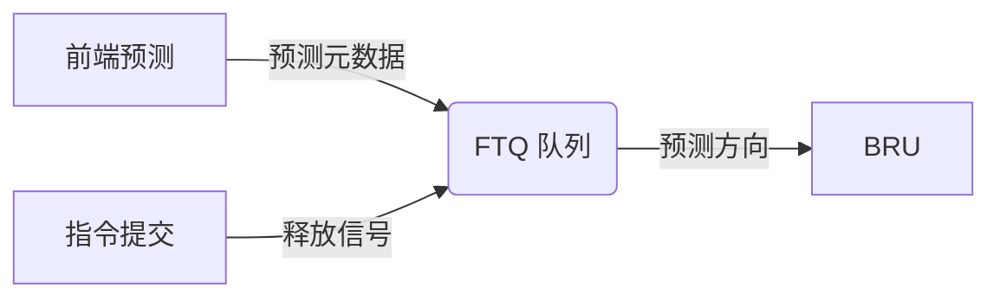

# FTQ (Fetch Target Queue) 模块设计文档

> [!WARNING]
> **当前状态**：功能级 (Functional Level) 实验性模块。
> 接口描述目前为逻辑对应关系，尚未实现物理级的精确 IO 握手接口。

## 1. 概述
FTQ (Fetch Target Queue) 是连接处理器前端（取指/预测）与后端（执行/验证）的关键微架构结构。它主要用于存储前端的分支预测元数据，并将其传递给后端执行单元进行结果验证，从而解耦前端预测与后端执行。

## 2. 接口定义 (逻辑接口)
由于目前处于功能级实现，接口定义侧重于信息流向。

| 信号/字段 | 方向 | 来源/去向 | 描述 |
|-----------|------|-----------|-----------|
| `start_pc`| 输入 | 前端 (Idu) | 取指块 (Fetch Block) 的起始 PC。用于重建块内指令的精确 PC (`PC = start_pc + offset * 4`)。 |
| `next_pc` | 输入 | 前端 (Idu) | 预测的下一取指块地址。用于后端分支验证中的 Target 校验。 |
| `ftq_idx`  | 输出 | 后端 (Exu) | 标识指令所属的 FTQ 条目索引。 |
| `ftq_offset`| 输出 | 后端 (Exu) | 指令在取指块内的偏移。 |
| `mispred`  | 输出 | 后端 (Bru) | 分支验证结果（涉及 PC 与 Target 的比对）。 |

## 3. 微架构设计

### 3.1 PC 记录与计算功能
FTQ 承担了部分 PC 管理职责，以平衡硬件开销与功能性：
- **PC 压缩存储**：后端不再在 ROB 中为每条指令存储完整的 32 位 PC，而是通过 `ftq_idx` 索引到 FTQ 中的 `start_pc`，结合 `ftq_offset` 进行重建。
- **分支目标验证 (Target Verification)**：BRU 执行时，会计算实际的 `pc_br`，并与 FTQ 中记录的 `next_pc` 进行比对。如果 `br_taken` 且 `pc_br != next_pc`，则判定为地址预测错误。
- **精确异常处理**：当发生异常时，通过 FTQ 重建精确的 PC 并写入 CSR (如 `mepc`)。

### 逻辑结构
FTQ 本质上是一个循环队列，每个条目管理一个**取指块 (Fetch Block)**。

### 核心工作流
1. **分配 (Allocation)**：在译码/分派阶段，为每个新进入后端的取指块在 FTQ 尾部申请条目。
2. **携带 (Carrying)**：每条微指令 (`MicroOp`) 携带其所属的 `ftq_idx` 穿过流水线。
3. **验证 (Verification)**：分支执行单元 (BRU) 根据 `ftq_idx` 读取 FTQ 中的预测信息，比对实际执行结果。
4. **回收 (Reclamation)**：当包含在该取指块内的所有指令成功提交 (Commit) 后，FTQ 头部指针向前移动，释放资源。

### 交互示意图

## 4. 关键特性
- **推测执行解耦**：允许前端在后端验证结果返回前继续预测。
- **精确恢复**：误预测发生时，FTQ 提供回滚点，确保前端能从正确的地址重新取指。

## 5. 待办事项 (精确化路径)
- [ ] 定义物理级的 Valid/Ready 握手信号。
- [ ] 细分 FTQ 条目内部的 TAGE 状态存储。
- [ ] 实现针对多分支并行验证的读端口扩展。

## 6. 验证
当前主要通过 `sha-test.bin` 和 `linux.bin` 等程序的正确运行来隐含验证 FTQ 的逻辑正确性。
