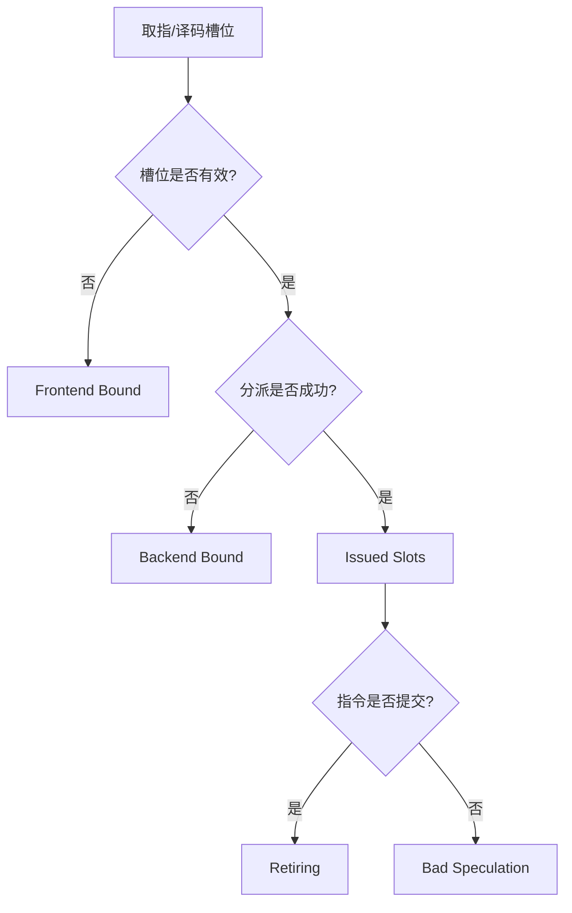

# TMA (Top-Down Microarchitecture Analysis) 性能分析方法

## 1. 概述
TMA 是一种旨在识别处理器性能瓶颈的结构化方法论。它通过将每一个可用的执行槽位 (Execution Slot) 分类，精确量化性能损失的来源。

在流水线的每一个周期，每一个取指宽度 (Fetch Width) 内的槽位会被归类为以下四类之一：
- **Retiring (提交)**: 有效执行并最终提交的指令。
- **Bad Speculation (错误预测)**: 占用了资源但最终因预测错误或异常被冲刷的指令。
- **Frontend Bound (前端受限)**: 前端未能及时向后端提供有效指令。
- **Backend Bound (后端受限)**: 后端因资源压力（如 ROB 满、LSU 阻塞）无法接受新指令。

## 2. 统计逻辑实现
TMA 的统计主要在分派阶段 (`Dispatch.cpp`) 的 `comb_fire` 逻辑中进行，利用 `PerfCount.h` 维护的全局计数器。

### 2.1 指标层级说明
| 层级 | 指标名称 (Metric) | 判定条件 |
| :--- | :--- | :--- |
| **Level 1** | **Frontend Bound** | 槽位无效 (`!inst_r[i].valid`) |
| | **Backend Bound** | 指令有效但分配由于资源不足失败 (`!dis_fire`) |
| | **Bad Speculation** | 指令已发射 (`dis_fire`) 但未最终提交 |
| | **Retiring** | 指令成功成功分派并提交 |
| **Level 2** | **Fetch Latency** | I-Cache 忙碌导致的 Frontend Bound |
| | **Memory Bound** | 访存资源（LDQ/STQ）或长延迟访存导致的 Backend Bound |
| | **Core Bound** | IQ 满或 ROB 满（非访存原因）引起的 Backend Bound |

## 3. 微架构统计点


## 4. 核心组件与交互
- **PerfCount**: 负责累加和格式化输出统计结果。
- **Dispatch 阶段**: 性能分析的观测点，连接前端供给和后端需求。
- **ROB**: 提供队头阻塞 (Head Stall) 信息，用于区分 Memory Bound (长延迟负载) 和 Core Bound。

## 5. 性能报告示例
执行结束后，模拟器会输出如下统计图表：
```
*********Top-Down Analysis (Level 1)************
Total Slots      : XXX
Frontend Bound   : XX.X%
Backend Bound    : XX.X%
Bad Speculation  : XX.X%
Retiring         : XX.X%
```
